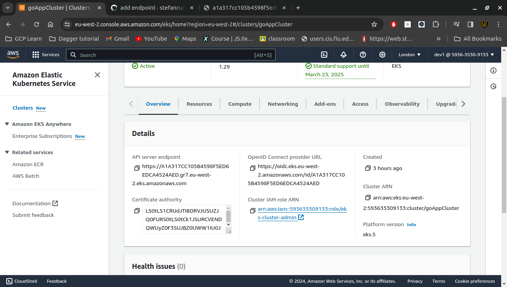
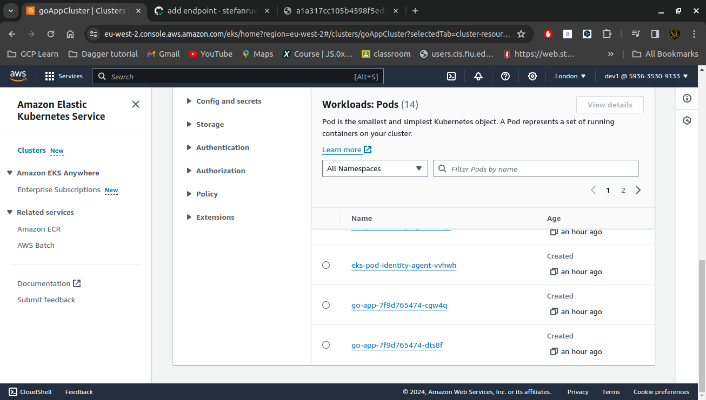
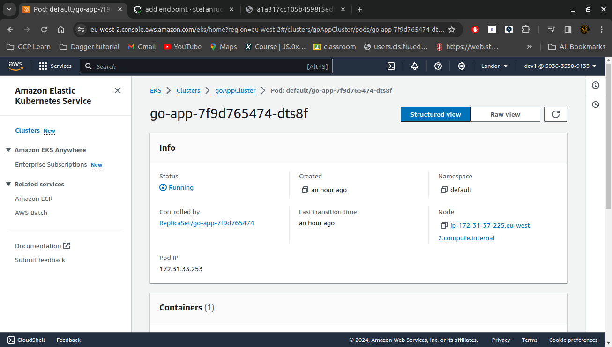
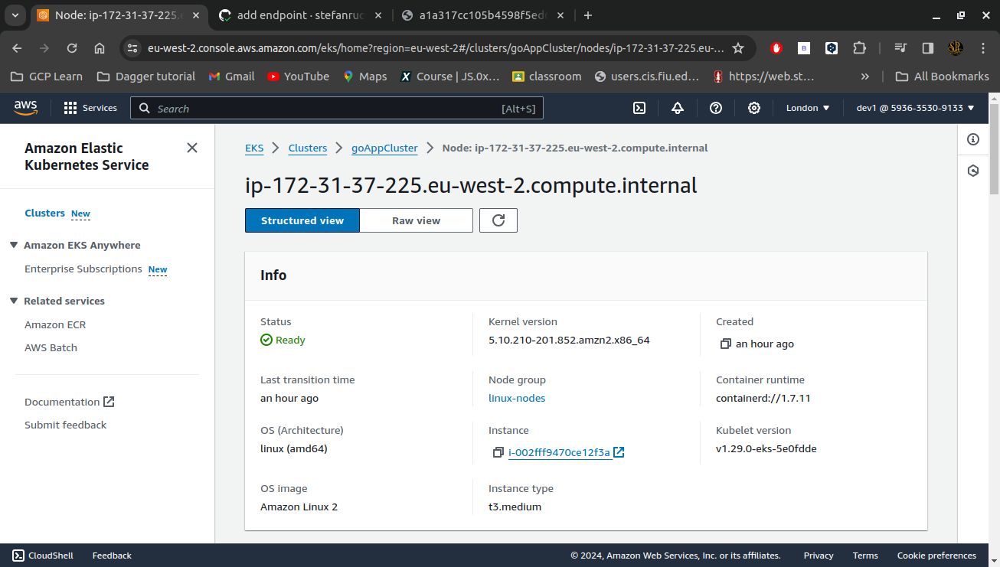
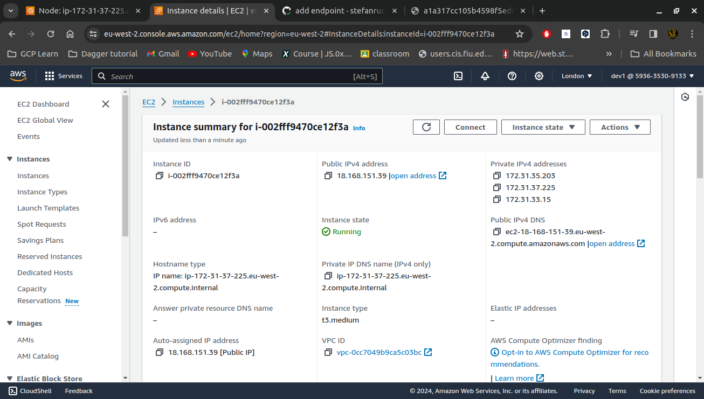

# Go Concurrency  Visualizer


```bash
sudo docker build -t my-goconc-app .

```

```bash
sudo docker run -p 8081:8081 -it --rm my-goconc-app 
```
```bash
kubectl apply -f deployment.yaml
```

```bash
kubectl apply -f service.yaml
```

```bash
docker run --rm -it public.ecr.aws/eksctl/eksctl create cluster --name pscluster --role-arn arn:aws:iam::593635309133:role/eks-cluster-admin --region eu-west-2  --nodes-min=3 --nodes-max=4 --instance-selector-vcpus=2 --instance-selector-memory=4 --version=1.28
```
```bash

aws eks create-cluster --name my-cluster --role-arn arn:aws:iam::593635309133:role/eks-cluster-admin  --resources-vpc-config subnetIds=subnet-0d72f00775aa5936b,subnet-04683708e88384540,subnet-0353cced6ff7a7cc0,securityGroupIds=sg-0a192f00348e94dc2 --region eu-west-2
```


    








